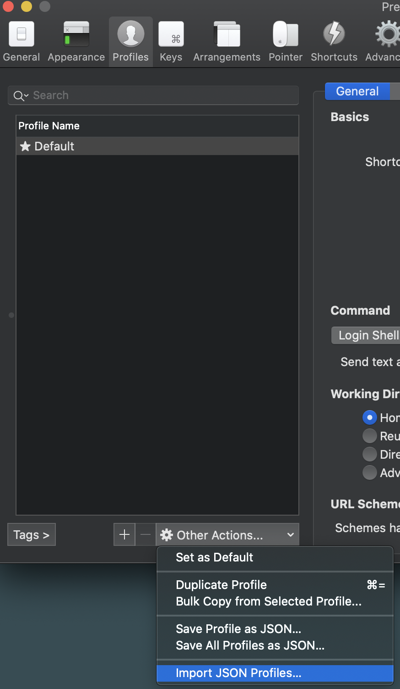

# Terminal and Shell

## Install [brew](https://brew.sh/):  
```bash
/bin/bash -c "$(curl -fsSL https://raw.githubusercontent.com/Homebrew/install/HEAD/install.sh)"
```

## Install [iterm2](https://iterm2.com/):  
```bash
brew update
brew install --cask iterm2
```

Import `Default.json` file:  



## Install [oh-my-zsh](https://ohmyz.sh/#install):  
- Git Aliases Cheatsheet: https://www.hschne.at/git-aliases/
```bash
sh -c "$(curl -fsSL https://raw.github.com/ohmyzsh/ohmyzsh/master/tools/install.sh)"

# This plugin is for syntax highlighting
git clone https://github.com/zsh-users/zsh-syntax-highlighting.git ${ZSH_CUSTOM:-~/.oh-my-zsh/custom}/plugins/zsh-syntax-highlighting

# This plugin is for autosuggestion
git clone https://github.com/zsh-users/zsh-autosuggestions $ZSH_CUSTOM/plugins/zsh-autosuggestions

# Zinit is a plugin manager for zsh
# sh -c "$(curl -fsSL https://raw.githubusercontent.com/zdharma/zinit/master/doc/install.sh)"


cp zshrc ~/.zshrc
```

## Install [Nerd Fonts](https://github.com/ryanoasis/nerd-fonts#option-4-homebrew-fonts):
```bash
brew tap homebrew/cask-fonts
brew install --cask font-hack-nerd-font
```

## Install [Powerlevel10k](https://github.com/romkatv/powerlevel10k):
```bash
git clone --depth=1 https://github.com/romkatv/powerlevel10k.git ~/powerlevel10k
echo 'source ~/powerlevel10k/powerlevel10k.zsh-theme' >>! ~/.zshrc	

cp p10k.zsh ~/.p10k.zsh	
```

# Editors

## Install [Vim Airline](https://github.com/vim-airline/vim-airline):
```bash
curl -fLo ~/.vim/autoload/plug.vim --create-dirs \
    https://raw.githubusercontent.com/junegunn/vim-plug/master/plug.vim

cp vimrc ~/.vimrc
```

## Install [Visual Studio Code](https://code.visualstudio.com/):
```bash
brew install --cask visual-studio-code
```
| Description                   | Action                                |
|-------------------------------|:-------------------------------------:|
| Preview markdown files 		| **⇧⌘V**								|
| Open extensions view	 		| **⇧⌘X**								|
| Column selection with mouse 	| **Shift+Option**						|
| Column selection	 			| **Shift+Option+Cmd and arrow keys**	|

# Install Kubernetes related packages  

[Podman](https://podman.io/):  
Podman is a daemonless container engine for developing, managing, and running OCI Containers on your Linux System.  

```bash
brew install podman && \
alias docker=podman &&\
podman machine init && podman machine start
```	

[Krew](https://krew.sigs.k8s.io/):  
Krew is the plugin manager for kubectl command-line tool.

```bash
(
  set -x; cd "$(mktemp -d)" &&
  OS="$(uname | tr '[:upper:]' '[:lower:]')" &&
  ARCH="$(uname -m | sed -e 's/x86_64/amd64/' -e 's/\(arm\)\(64\)\?.*/\1\2/' -e 's/aarch64$/arm64/')" &&
  curl -fsSLO "https://github.com/kubernetes-sigs/krew/releases/latest/download/krew.tar.gz" &&
  tar zxvf krew.tar.gz &&
  KREW=./krew-"${OS}_${ARCH}" &&
  "$KREW" install krew
)

# Add in .zshrc file:
export PATH="${KREW_ROOT:-$HOME/.krew}/bin:$PATH"
```

 [kubectl]()  
 [kubectx]()  
 [minikube]()  
 [helm]()  
 [k9s]()  
 [kube-ps1]()  

```bash
brew install \
	kubectl kubectx minikube helm k9s kube-ps1
```	

# Install other packages

## [Tmux]()
| Description                  | Action                 |
|------------------------------|:----------------------:|
| Creates a new window         | **Ctrl-b c**           |
| Go to next window            | **Ctrl-b n**           |
| Go to previous window        | **Ctrl-b p**           |
| Split window top/bottom      | **Ctrl-b "**           |
| Split window left/right      | **Ctrl-b %**           |
| Rearrange windows in columns | **Ctrl-b Alt-1**       |
| Rearrange windows in rows    | **Ctrl-b Alt-2**       |
| Navigate to other windows	   | **Ctrl-b arrow keys**  |
| Detach session			   | **Ctrl-b d**           |
| Reattach to session		   | **tmux attach**        |


## [Mosh](https://mosh.org/#getting)
Remote terminal application that allows roaming, supports intermittent connectivity, and provides intelligent local echo and line editing of user keystrokes.

## [gh](https://github.com/cli/cli)  
`gh` is GitHub on the command line. It brings pull requests, issues, and other GitHub concepts to the terminal next to where you are already working with `git` and your code.

## [LazyGit](https://github.com/jesseduffield/lazygit)  
A simple terminal UI for git commands, written in Go with the gocui library.

## [AWScli](https://aws.amazon.com/cli/)  
The AWS Command Line Interface (CLI) is a unified tool to manage your AWS services. With just one tool to download and configure, you can control multiple AWS services from the command line and automate them through scripts.

## [htop](https://htop.dev/)  
 This is htop, a cross-platform interactive process viewer. It is a text-mode application (for console or X terminals) and requires ncurses. 

## [pstree](https://man7.org/linux/man-pages/man1/pstree.1.html)  
Display a tree of processes

## [bat](https://github.com/sharkdp/bat) 
`bat` supports syntax highlighting for a large number of programming and markup languages:

## [Fuzzy Finder](https://github.com/junegunn/fzf) 
It's an interactive Unix filter for command-line that can be used with any list; files, command history, processes, hostnames, bookmarks, git commits, etc.

## [rambox](https://rambox.app/#home)  
Rambox is a workspace browser that allows you to manage as many applications as you want, all in one place. It is perfect for people who care about productivity and work with many applications, both business and personal.

```bash
brew install \
	gh lazygit \
	tmux mosh awscli rambox htop pstree bat inav fzf
```	
---
Inspiration from:  

https://medium.com/@jeantimex/how-to-configure-iterm2-and-vim-like-a-pro-on-macos-e303d25d5b5c